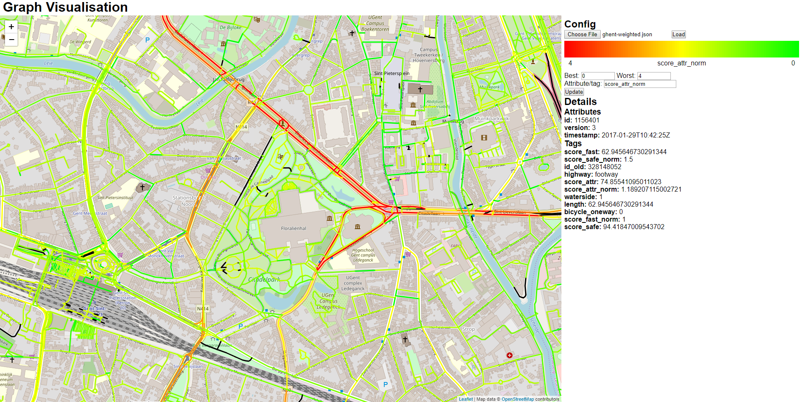

# Preprocessing
## Dependencies
 - Osmosis: This program is used to extract information on different kinds of features from the osm data. The executable should be added to your PATH variable.
	- Windows: Download the latest version [here](http://wiki.openstreetmap.org/wiki/Osmosis/Quick_Install_(Windows)), unzip it and add the bin subfolder to your path. It may be necessary to open the osmosis.bat file and change PLEXUS_CP so that it matches the attached plexus jar in lib\default.
	- [Other](http://wiki.openstreetmap.org/wiki/Osmosis/Installation)
 - Osm2graph: This program matches features from one or more osm data sources and converts the osm representation into a graph representation. Requirements of osm2graph and additional info can be found on [this page](https://github.com/Pistro/osm2graph). You should compile the project into an executable jar, or alternatively, you may download the .jar file from the [release page](https://github.com/Pistro/osm2graph/releases). The .jar file should be placed into this folder. 
 - Python: Python scripts are used to coordinate the other programs, and to combine the extracted features into various weights.
 
## Input data
The osm data of the region that is processed should also be provided as an .osm.pbf file. Via [geofabrik](http://download.geofabrik.de/), osm data can be downloaded in this format for regions or entire continents.
 
## Collecting map features
The 'collect_info.py' script will call osmosis and osm2graph.jar (which should be placed into this folder) to extract features from the provided input data. Several intermediate files will be created:
 - regionName_way.osm: This file contains the entire road network of the region. This file is of no use after the preprocessing step.
 - regionName_busy_ways.osm: This file contains all primary, secondary and tertiary ways of the region. It is used for checking which roads are close to busy ways. This file is of no use after the preprocessing step.
 - regionName_poi.osm: This file contains all points of interest (POIs) in the region. It is used for matching POIs to the closest nearby road. This file is of no use after the preprocessing step.
  - regionName_forest_way.osm: This file contains all forests in the region. It is used for checking whether a road passes through a forest. This file is of no use after the preprocessing step.
 - regionName_water.osm: This file contains all waterways, lakes and reservoirs in the region. It is used for checking whether a road passes is close to water. This file is of no use after the preprocessing step.

All this information is combined into a single .osm file, which contains the entire road network of the region, and where the roads have some extra tags, describing their proximity to poi's, forests, busy ways or waterways.

You can execute this script by opening a shell and running: `python collect_info.py`. Before executing this command however, you should open the script file and check the last few lines. The following arguments must be provided:
- 'infile' should provide the path of the input .osm.pbf file
- 'tmpfolder' refers to an existing folder in which the temporary files may be stored
- 'tmpprefix' will replace the word 'regionName' in the temporary files
- 'outfile' should provide the path of the output .osm file

## Assigning weights to roads
The 'assign_weights.py' script reads through a provided .osm file, and adds to each way several extra tags:
- bicycle_oneway: Set to 0 for ways which allow bidirectional cycling traffic, set to 1 if cycling traffic is unidirectional in the direction of the way, and set to -1 if cycling traffic is unidirectional, opposite to the direction of the way. The tag is defined for all ways which allow bicycle traffic.
- score_safe: the 'perceived length considering safety of the road'. Roads which are more unsafe for cyclists have a higher perceived length.
- score_attr: the 'perceived length considering attractiveness of the road'. Roads which are less attractive for cyclists have a higher perceived length.
- score_fast: the 'perceived length considering fastness of the road'. Legacy: this should be proportional to the travelling time of the road stretch. This should take into account hight differences and traffic lights. Currently, it is just the length of the road.

For each score, a 'normalized score' is added as well, which is simply the score divided by the length of the corresponding stretch of road. These normalized scores are stored in the tags 'score_safe_norm', 'score_attr_norm' and 'score_fast_norm'.

The script is executed by opening a shell and running: `python assign_weights.py`. Before executing this command however, you should open the script file and check the last few lines. The following arguments must be provided:
- 'infile' should provide the path of the input .osm file
- 'outfile' should provide the path of the output .osm file

## Optional: Visualising & exploring the assigned scores
In order to get a better understanding of which roads score well with regards to certain scores and compare roads, the scores can be visualised.

Attempting to visualize all ways in a country-sized region is very compute intensive, and also does not result in an informative figure. Hence, before converting the .osm file into a .json file which can be visualized in the browser (which can be achieved with osm2graph), osmosis is used to extract a smaller city-sized rectangular region.
Example code on how to achieve this is provided in 'extract_region.py'.

The [osm2graph repository](https://github.com/Pistro/osm2graph) contains a .html file which allows to visualise the .json file. Note that the visualisation will only draw ways when the number of on-screen ways is small, so you may need to zoom in before anything appears on the map.

